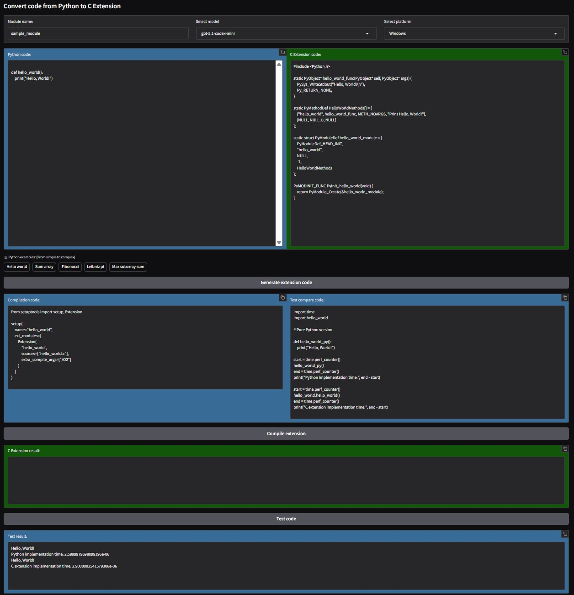

## Python C Extension code generator

A Gradio app that provides an interactive interface for users to input Python code and
generate C extension code

Optionally, a compile and eval stage can be activated for local deployments to compare
its performance against the original Python code.

> [!CAUTION]
>
> **Always review the generated codes before running them, as they will be executed in
> your local environment and may contain code that could be harmful or unwanted.**
>
> AI-generated code may contain errors or unsafe practices, so it's crucial to
> thoroughly review and test on a sandboxed environment any code before using it in a
> production environment.
>
> Never run code generated by AI models without understanding its implications and
> ensuring it adheres to your security and safety standards.

> [!IMPORTANT]
>
> **Disclaimer:** This App and Notebook are provided for educational purposes only.
> Use it at your own risk.

### Installation

* Install the required Python dependencies:

  ```bash
  pip install -r requirements.txt
  ```

* Or, if you prefer Pipenv:

  ```bash
  pipenv install
  ```

### Configuration

The app reads configuration from environment variables and from a `.env` file if present.

* `MODELS`: Colon-separated list of models to expose in the dropdown.\
  Example:

  ```bash
  export MODELS="gpt-5.1-codex-mini:gpt-5.4-mini"
  ```

  ```powershell
  $env:MODELS = "gpt-5.1-codex-mini:gpt-5.4-mini"
  ```

  If not set, the app defaults to `gpt-5.1-codex-mini` and `gpt-5.4-mini`.

* `COMPILE_STAGE`: Set to `true`, `1`, or `yes` to enable the compile and test stage.\
  Example:

  ```bash
  export COMPILE_STAGE=true
  ```

  ```powershell
  $env:COMPILE_STAGE = "true"
  ```

### Running locally

* Run the app locally with:

  ```bash
  python app.py
  ```

* For autoreload during development, use the Gradio CLI:

  ```bash
  gradio app.py
  ```

### Gradio app overview

In this image, you can see the Gradio app dashboard whose main sections are
described below.

\
*Image: Gradio app dashboard with default example `hello world` code loaded.*
*(compile output redacted for privacy)*

Sections:

* **Dropdown selectors and input fields**:
  * **Module name input**:
    A text input field where users can specify the name of the C extension module to be
    generated.

    That name will be used to create the C extension file `<module_name>.c` and
    the `setup.py` file required to compile the extension.

    That name will also be used to import the compiled module as usual in Python:

    ```python
    import <module_name>
    ```

    Or

    ```python
    from <module_name> import <function_name>
    ```

  * **Model selector**:
    A dropdown menu to select the model used for code generation.

    The available options are taken from the `MODELS` environment variable if set.
    Otherwise the app defaults to `gpt-5.1-codex-mini` and `gpt-5.4-mini`.

  * **Platform selector**:
    A dropdown menu to select the target platform for the generated C extension.

    This affects how the app frames the prompt for the model and ensures the
    generated code targets the selected platform (`Windows` or `Linux`).

  * **Examples selector**:
    A list of ready-made Python examples to load into the input field.

    Built-in examples include `Hello world`, `Sum array`, `Fibonacci`, `Leibniz pi`,
    and `Max subarray sum`.

* **Text input areas**:

  These areas are all editable, including those filled with generated code by the model.
  This allows users to modify and experiment with the code as needed.

  * **Python code**:
    A text area where users can input their Python code.

    > [!NOTE]
    >
    > We are creating an importable module not an executable program so the code to be
    > optimized must contain only declarations such as DEF or CLASS.

  * **C extension code**:
    A text area that displays the generated C extension code.
  * **Compilation code**:
    A text area that shows the generated `setup.py` code.
    This file is required to compile the C extension.
  * **Test compare code**:
    A text area that provides example code to run the compiled C extension.

* **Output areas**:

  These are non-editable areas that display the results of various operations.

  * **C Extension result**:
    A text area that displays the output of the C extension code build.

    Beware that this area can contain a large amount of text including warnings during
    the compilation process and sensible information about the local environment,
    like: paths, Python version, etc may be included.

    Redact that information if you plan to share the output.

  * **Test result**:
    A text area that displays the output of the test code run.

* **Buttons**:
  * **Generate extension code**:
    A button that triggers the generation of the C extension code from the provided
    Python code.

    It will call the model to generate the C code, the setup.py file and the test code,
    filling the corresponding text areas automatically.

  * **Compile extension**:
    A button that compiles the generated C extension using the provided `setup.py` file.
    It will create the extension C file, `<module_name>.c`, and the `setup.py` file in
    the local folder, then it will run the compilation command and build the C extension,
    `<module_name>.<arch_info>.pyd`.\
    *`arch_info` represents architecture info the extension has been compiled for:*

    * `hello_world.cp313-win_amd64.pyd`: CPython 3.13 + Windows + Amd64 Architecture.

    > [!CAUTION]
    >
    > **Always review the `setup.py` code before running it, as it will be executed in
    > your local environment and may contain code that could be harmful or unwanted.**
    >
    > **Also review the generated C code, as it will be compiled and executed in your
    > local environment and may contain code that could be harmful or unwanted.**

    It will display the compilation output in the "C Extension result" area.

  * **Test code**:
    A button that executes the test code to compare the performance of the original
    Python code and the generated C extension.

    > [!CAUTION]
    >
    > **Always review the test code before running it, as it will be executed in
    > your local environment and may contain code that could be harmful or unwanted.**

    Will save the test code provided in the "Test compare code" into the
    `usage_example.py` file and execute it, showing the output in the "Test result" area.
